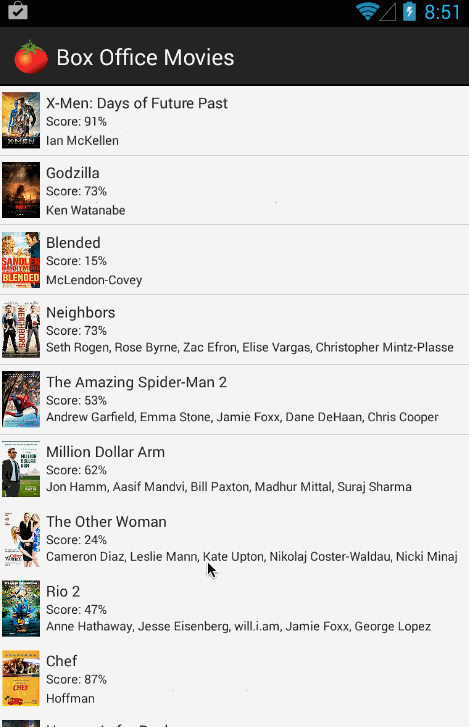

# RottenTomatoes Box Office Demo

(Sample of your weekly project submission README)

This is an Android demo application for displaying the latest box office movies using the [RottenTomatoes API](http://www.rottentomatoes.com/). See the [RottenTomatoes Networking Tutorial](https://github.com/codepath/android_guides/wiki/Rotten-Tomatoes-Networking-Tutorial) on our cliffnotes for a step-by-step tutorial.

**Time spent:** 5 hours spent in total

Completed user stories:

 * [x] Required: User can view a list of latest box office movies including title, cast and tomatoes rating
 * [x] Required: User can click on a movie in the list to bring up a details page with additional information such as synopsis
 * [x] Optional: Placeholder image is used for movie posters loaded in from the network
 
**Notes:**

Spent some time making the UI work across multiple phone resolutions by playing around with the RelativeLayout.

**Walkthrough of all user stories:**

GIF created with [LiceCap](http://www.cockos.com/licecap/).

## Libraries

This app leverages two third-party libraries:

 * [Android AsyncHTTPClient](http://loopj.com/android-async-http/) - For asynchronous network requests
 * [Picasso](http://square.github.io/picasso/) - For remote image loading
